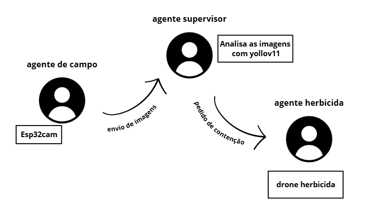

# 🌱 Weed Detection Agents – Simulação Multiagente

Este repositório é uma **simulação de arquitetura multiagente** para um sistema de detecção e contenção de ervas daninhas em plantações de grãos (soja, milho, feijão) **em tempo real**, simulando um ambiente embarcado com três agentes principais:

- **Agente de Campo**
- **Agente Supervisor**
- **Agente Herbicida**

---

## 🎯 Objetivo do Projeto

Responder ao seguinte desafio:

> Suponha que você tenha a necessidade de desenvolver um algoritmo para reconhecimento de ervas daninhas através de imagens em plantações de grãos em tempo real (sistema embarcado). Quais técnicas de software você utilizaria? Como você descreveria o plano de atividades a serem executadas para desenvolver este sistema?

---

## 🧠 Solução Simulada

A proposta modela um **sistema BDI (Belief-Desire-Intention)** com comunicação entre agentes via API REST. Cada agente toma decisões com base em crenças internas e contexto do ambiente, simulando:

1. **Captura e análise de imagem (YOLOv11 simulado)**
2. **Detecção de ervas daninhas**
3. **Coordenação entre agentes**
4. **Aplicação de herbicida automatizada**

---

## 🛠️ Tecnologias e Técnicas Utilizadas

- **Esp32Cam** para detecção das imagens em tempo real (em `.\code\agent_field.py` melhores explicações em `.\docs\ESP32Cam - Ideia de arquitetura` ou `.\doc\esp32cam.ipynb`)
- **Simulação de YOLOv11** (em `.\code\agent_supervisory.py` melhores explicações de treinamento em `.\docs\yolo.ipynb`)
- **Sistema BDI customizado** para controle de planos, crenças e intenções
- **Flask** para endpoints REST simulando comunicação entre agentes
- **Multithreading** para simular agentes reativos contínuos
- **Arquitetura orientada a eventos com troca de mensagens JSON**

---

## 🚀 Como Rodar o Projeto

1. **Clone o repositório**:


2. **Instale as dependências**:
   ```bash
   pip install flask requests
   ```

3. **Execute os agentes em terminais separados** (ordem recomendada):

   **Terminal 1 – Agente de Campo:**
   ```bash
   python agent_field.py
   ```

   **Terminal 2 – Supervisor:**
   ```bash
   python agent_supervisory.py
   ```

   **Terminal 3 – Agente Herbicida:**
   ```bash
   python agent_herbicide.py
   ```

---

## 📋 Plano de Atividades Realistas (Para um sistema real embarcado)

1. **Captura de imagem com câmera embarcada**
2. **Execução local de modelo YOLOv11 (ou MobileNet)** para detecção
3. **Classificação com modelo treinado via Transfer Learning**
4. **Filtragem de ruído e análise temporal**
5. **Coordenação multiagente (ou multi-thread com prioridades)**
6. **Ação: acionar sistema físico (drone ou trator) para herbicida**
7. **Monitoramento e feedback via dashboard web**

---

## 🤖 Arquitetura dos Agentes



---

## 📦 Observação

Esta simulação **não realiza detecção real de imagem**, apenas estrutura a lógica de comunicação e decisão para fins didáticos e exploratórios.
